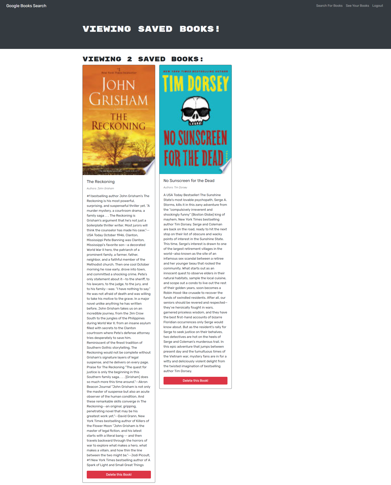

  # Good-Books

  

  ## Description
  Good Books is an app that utilizes the Google Books API to allow users to search for books and then save titles they are interested in to their account. The app uses the MERN stack and GraphQL instead of a traditional RESTful API.

  ## Live
  [Live Link](https://salty-citadel-90852.herokuapp.com/)

  

  ## Table of Contents
  * [Description](#description)
  * [Live](#live)
  * [Installation](#installation)
  * [Usage](#usage)
  * [License](#license)
  * [Contribution](#contribute)
  * [Questions](#questions)

  ## Installation
  The working app can be accessed from the live link listed above. If you want a local version to look at, you can clone the git hub repo to your local machine and run "npm -install" to install the necessary dependencies to run it locally. It uses MongoDB, which you will already need to have installed beforehand.

  ## Usage
  Navigate to the site linked in the Live Link above. Enter a book, author, subject, etc in the search bar to search Google Books. The resultes will populate in the page below. If you are not logged in, you will be able to search and view books, but will be unable to save any for future reference. Click "Login/Sign Up" to either log in or create an account. When you are logged in, and you perform a search, you will see a button below each search result that you can click on to add the book to your list. Once you have books on your list, click on "See Your Books" to see the list of books you have saved. You can click on the "Delete this Book!" button to remove the selection from your list of saved books."

  ## License
  This software is licensed under the [MIT license](https://choosealicense.com/licenses/mit/).

  ## Contribution
  This project follows the guidelines of the [Contributor Covenant](https://www.contributor-covenant.org/version/2/0/code_of_conduct/). If you are interested in contributing, please contact me at my email in the Questions section of this README.

  ## Questions
  If you have any questions about this project, you can email me at joe.lawton@outlook.com.
  For other projects, check out my [GitHub](https://github.com/jdlawton).
